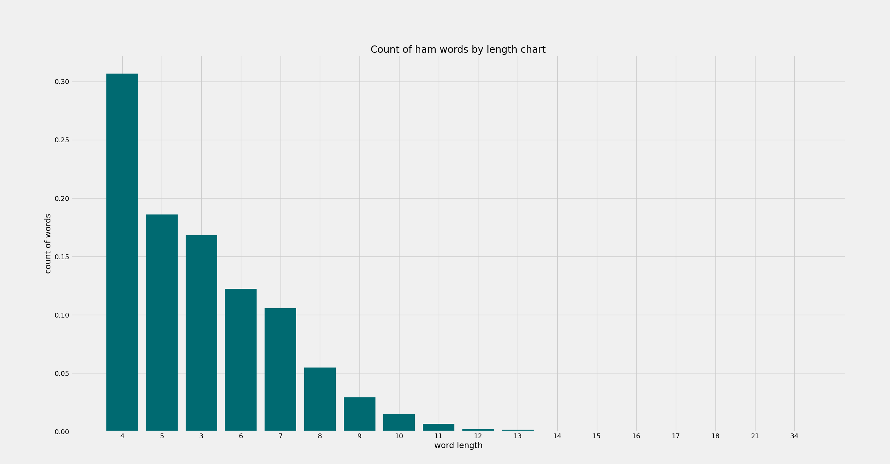
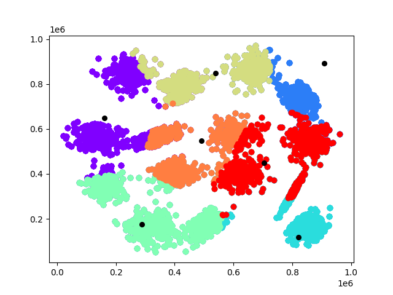
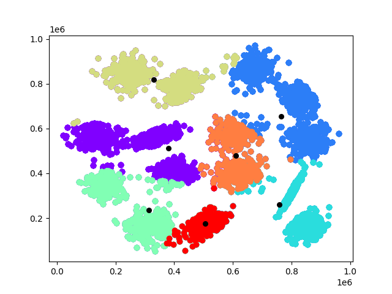

# data-mining-purple

This repository stores my simple data-mining scripts. These tasks were implemented in the scope of my university study
at the 4th course. The repository contains only Python scripts. You may need additional (very popular and easy to
install) Python libraries. Such as:

* matplotlib
* networkx
* numpy
* nltk
* pandas

I won't list all of them here, because I'm sure you will figure out what libraries you require and how to install them
on your own.<br>
The "purple" word was added to the repository name just to differ the repository from my other possible data-mining
repositories.

## Description

The repository consist of five parts:

1. data-statistical-analysis
2. naive-bayes-classifier
3. k-means-method
4. page-rank
5. market-basket-analysis

All these parts have their own folder where you find everything you need to run the scripts.

### data-statistical-analysis

In this part I made a data statistical analysis of the file `sms-spam-corpus.csv`. This file contains spam and ham
sms. <br>
The part consist of three sub-parts:

1. [Plot on the graphs the distribution of word length for each category and the average word length](data-statistical-analysis/task_1_word_len_plot.py)
2. [Graph the distribution of message lengths for each category and the average message length](data-statistical-analysis/task_2_msg_len_plot.py)
3. [Conduct a frequency analysis of the appearance of words for two categories. Display on the graphs 20 words that are most common for each category separately](data-statistical-analysis/task_3_top_20_words_plot.py)

**You must run the [data_processor.py](data-statistical-analysis/data_processor.py) before running the other
scripts.**<br>

`python data_processor.py`

Then, choose the part you need and ran the script. For example, I will run the first sub-part:<br>

`python task_1_word_len_plot.py`

After this, the script will show two plots (for ham and for spam words).




You can find the average word length in the console (terminal) output:

```
Average word length for spam is 5.339024390243902
Average word length for ham is 5.131272645653637
```

Also, all three sub-parts scripts save their plot in the specific [folder](data-statistical-analysis/output).

### naive-bayes-classifier

This part calculates message spam and ham possibility using training data
in [ham_words_count.csv](naive-bayes-classifier/ham_words_count.csv)
and [spam_words_count.csv](naive-bayes-classifier/spam_words_count.csv) files.

Run the script by the next command:

```
python main.py
```

Then, you will see the next output:

```
Welcome to Saint-Tropez
Spam file name is "spam_words_count.csv"
Ham file name is "ham_words_count.csv"
Type your message:
```

You need to specify your message here. For example:

```
Welcome to Saint-Tropez
Spam file name is "spam_words_count.csv"
Ham file name is "ham_words_count.csv"
Type your message: Hello, world! How it's going?
```

After this you will see the result:

```
Preparing message...
Prepared message: "['world', 'go']"
Loading training data from files to memory...
Training data was successfully loaded
Calculating probability for both spam and ham...
Spam probability is "2.0651496689859363e-08"
Ham probability is "3.906686353734016e-08"
Making normalization...
Normalized:
Spam probability is "0.3458148651652589"
Ham probability is "0.6541851348347411"
Classifying the message...
The message "Hello, world! How it's going?" is a HAM
```

So, in the example above our classifier thinks that the message "Hello, world! How it's going?" is a ham.

### k-means-method

In this part, I implemented k-means method for a 2-D array of dots. The example input files you find in
the [points_datasets](k-means-method/points_datasets) folder.<br>
To run the script use the next command:

```
python main.py 7 points_datasets/s1.txt
```

Where:

* 7 - the count of clusters I need (you may choose your own count);
* [s1.txt](k-means-method/points_datasets/s1.txt) - the file with points data (you may use another file if you
  want).

After the execution, you will see the first plot, on which centers were randomly selected, and the dots were spread
between them.



Close this plot and the program will start the classification. After the finish, the program will show you the final
plot.



The count of steps needed to finish you will find in the console (terminal) output:

```bash
Program used 16 step(-s) to finish.
```

### page-rank

The script builds a page graph of the site and calculates the site's pages rank. You can run the script by the next
command:<br>

`python main.py http://thedemosite.co.uk/`

For our example, you will see the next graph


The page rank of the pages you will find in the console (terminal) output:<br>

```json
{
  "/": 0.018750000000000003,
  "index.php": 0.17862779158724276,
  "thedatabase.php": 0.17862779158724276,
  "addauser.php": 0.17862779158724276,
  "login.php": 0.17862779158724276,
  "getyourowndbonline.php": 0.17862779158724273,
  "addausercode.php": 0.044055521031893,
  "logincode.php": 0.044055521031893
}
```

### market-basket-analysis

In this part I implemented market basket analysis. The analysis may be done
by [apriori](market-basket-analysis/apriori_alg.py) or by [genetic](market-basket-analysis/genetic_alg.py)
algorithms.<br>

**CAUTION:** the apriori script executes too long and has a very big impact on the processor. I don't recommend you to
run it on a big amount of data.<br>

To run the **apriori algorithm** script use the next command:

```commandline
python apriori_alg.py 2 test.XLSX
```

Where:

* 2 - support level (you may choose your own value);
* [test.XLSX](market-basket-analysis/test.XLSX) - the file with purchases data (you may use another file if you want).

After the script execution, you will see the following in your console(terminal):

```json
{
  "('84029G', '85123A', '84030E')": 2,
  "('84029G', '85123A', '84029E')": 2,
  "('84029G', '85123A', '85014B')": 2,
  "('84029G', '85123A', '84625A')": 2,
  "('84029G', '85123A', '85014A')": 2,
  "('84029G', '85123A', '85099F')": 2,
  "('84029G', '84029E', '85014B')": 2,
  "('84029G', '84029E', '84625A')": 2,
  "('84029G', '84029E', '85014A')": 2,
  "('84029G', '84029E', '85099F')": 2,
  "('15056BL', '15056N', '85099B')": 2,
  "('15056BL', '15056N', '85123A')": 2,
  "('15056BL', '15056N', '84030E')": 2,
  "('15056BL', '15056N', '84029E')": 2,
  "('15056BL', '15056N', '85014B')": 2,
  "('15056BL', '15056N', '84625A')": 2,
  "('15056BL', '15056N', '85014A')": 2,
  "('15056BL', '15056N', '85099F')": 2,
  "('85099C', '85099B', '85123A')": 3,
  "('85099C', '85099B', '84030E')": 3,
  "('85099C', '85099B', '84029E')": 3,
  "('85099C', '85099B', '85014B')": 3,
  "('85099C', '85099B', '84625A')": 3,
  "('85099C', '85099B', '85014A')": 3,
  "('85099C', '85099B', '85099F')": 3,
  "('85014B', '85014A', '85099F')": 2,
  "('85099B', '85123A', '84030E')": 2,
  "('85099B', '85123A', '84029E')": 2,
  "('85099B', '85123A', '85014B')": 2,
  "('85099B', '85123A', '84625A')": 2,
  "('85099B', '85123A', '85014A')": 2,
  "('85099B', '85123A', '85099F')": 2,
  "('85123A', '84030E', '84029E')": 2,
  "('85123A', '84030E', '85014B')": 2,
  "('85123A', '84030E', '84625A')": 2,
  "('85123A', '84030E', '85014A')": 2,
  "('85123A', '84030E', '85099F')": 2,
  "('84625C', '84625A', '85014A')": 2,
  "('84625C', '84625A', '85099F')": 2,
  "('84625C', '85169B', '15056N')": 2,
  "('84625C', '85169B', '85099B')": 2,
  "('84625C', '85169B', '85123A')": 2,
  "('84625C', '85169B', '84030E')": 2,
  "('84625C', '85169B', '84029E')": 2,
  "('84625C', '85169B', '85014B')": 2,
  "('84625C', '85169B', '84625A')": 2,
  "('84625C', '85169B', '85014A')": 2,
  "('84625C', '85169B', '85099F')": 2,
  "('85231G', '85231B', '84029G')": 2,
  "('85231G', '85231B', '85099C')": 2,
  "('85231G', '85231B', '85169B')": 2,
  "('85231G', '85231B', '15056N')": 2,
  "('85231G', '85231B', '85099B')": 2,
  "('85231G', '85231B', '85123A')": 2,
  "('85231G', '85231B', '84030E')": 2,
  "('85231G', '85231B', '84029E')": 2,
  "('85231G', '85231B', '85014B')": 2,
  "('85231G', '85231B', '84625A')": 2,
  "('85231G', '85231B', '85014A')": 2,
  "('85231G', '85231B', '85099F')": 2,
  "('85231G', '85099B', '85123A')": 2,
  "('85231G', '85099B', '84030E')": 2,
  "('85231G', '85099B', '84029E')": 2,
  "('85231G', '85099B', '85014B')": 2,
  "('85231G', '85099B', '84625A')": 2,
  "('85231G', '85099B', '85014A')": 2,
  "('85231G', '85099B', '85099F')": 2,
  "('85231B', '85099B', '85123A')": 2,
  "('85231B', '85099B', '84030E')": 2,
  "('85231B', '85099B', '84029E')": 2,
  "('85231B', '85099B', '85014B')": 2,
  "('85231B', '85099B', '84625A')": 2,
  "('85231B', '85099B', '85014A')": 2,
  "('85231B', '85099B', '85099F')": 2
}
```

Where the key is a triple of products, and the value is the count of this triple popularity in the baskets.

To run the **genetic algorithm** script use the next command:

```commandline
python genetic_alg.py "Filtered Online Retail.xlsx"
```

Where:

* [Filtered Online Retail.xlsx](market-basket-analysis/Filtered%20Online%20Retail.xlsx) - the file with purchases data (
  you may use another file if you want).
  
After the script execution, you will see the TOP-10 product triples in your console(terminal):

```json
 [
    [
        "20728",
        "20726",
        "22382",
        180
    ],
    [
        "21928",
        "85099B",
        "22386",
        130
    ],
    [
        "22423",
        "22697",
        "47566",
        126
    ],
    [
        "85099C",
        "23199",
        "85099B",
        123
    ],
    [
        "22423",
        "22697",
        "85123A",
        104
    ],
    [
        "23199",
        "23344",
        "22382",
        86
    ],
    [
        "20728",
        "20726",
        "21212",
        84
    ],
    [
        "21928",
        "85099B",
        "20713",
        84
    ],
    [
        "22423",
        "22697",
        "21212",
        78
    ],
    [
        "20728",
        "20726",
        "22086",
        78
    ]
]
```

## Author 🦝

- Name: Evgeniy Kiprenko
- Email: zhenyakiprenko@gmail.com
- [LinkedIn](https://www.linkedin.com/in/kiprenko/)
